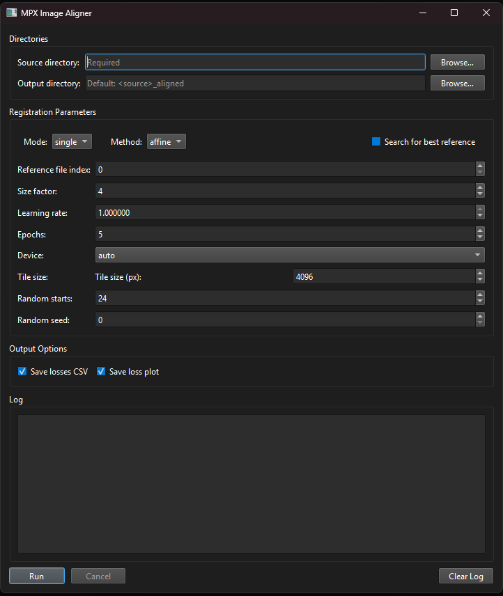

# MPX Image Aligner

A multiplexed fluorescence image alignment tool with both a graphical user interface (GUI) and a command-line interface (CLI). It uses GPU-accelerated image registration via PyTorch to align multi-channel images across imaging cycles.

The image registration backend is based on modified source code from [TorchRegister](https://github.com/AgamChopra/TorchRegister) by Agam Chopra (AGPL-3.0), which provides affine and rigid registration via PyTorch. The GUI component uses [PyQt6](https://riverbankcomputing.com/software/pyqt/) by Riverbank Computing (GPL-3.0).

Supports **TIFF** and **CZI** file formats.

## Features

- Affine and rigid image registration
- GPU acceleration via PyTorch (CUDA supported)
- PyQt6 GUI for interactive use
- Full CLI for scripted/automated pipelines
- Automatic reference file selection based on loss threshold
- Outputs aligned multi-channel TIFF with channel name metadata
- Saves training loss curves as CSV and PNG

## Installation

### Prerequisites

- Python ≥ 3.10
- [pipx](https://pipx.pypa.io/) (recommended) or pip

### Standard install (CPU only)
If you do not have pipx installed, then use the following commands to install with pip and set the correct PATH variable.

```bash
pip install pipx
pipx ensurepath
```

Once pipx is installed, you can download the repository and from within the main directory call:

```bash
pipx install .
```

### CUDA-enabled install (recommended for large images)

To use GPU for accelerated image registration, make sure that your computer has a CUDA-capable graphics card installed and drivers are up-to-date. 
Below is an example for use with CUDA 12.6. If your system requires a different CUDA wheel, adjust accordingly.

```bash
pipx install . --pip-args="--extra-index-url https://download.pytorch.org/whl/cu126"
```

## Usage

### Input

The Image Aligner takes a directory containing multiple image files in **.tiff**, **.ome.tiff** or **.czi** format as input. Please adhere to the following naming conventions, which is required to extract marker names, date of acquisition and sample ID:

1. Name the input directory with the unique sample ID
2. The name of the image files needs to adhere to the following convention:
   1.  `<date>_<sample-id>_<ch1> <ch2> ... <chi><.ext>`, where
       1.  `<date>` refers to the date of acquisition
       2.  `<sample-id>` is the unique sample ID
       3.  `<ch1>` etc. are the marker names of each channel, separated by whitespace. **DAPI** should always be the first channel, followed by specific markers.
       4. `<.ext>` is the file extension. The following are supported: **.tiff**, **.ome.tiff**, **.czi**.

For **batched** processing, put all sample folders into a common directory. The batched processing will then loop over all folders. 

#### Examples

`20260316_BL1_DAPI CD3 CD4 CD8.ome.tiff`

`D1_BL1_DAPI cd3 cd4 cd8.czi`

#### Some notes on image preprocessing

For the alignment to work properly, the input image files must be of sufficient quality. If any image contains major tissue artefacts, stitching errors, or warped/detached tissue areas, the alignment will very likely fail. Therefore, before running the pipeline, make sure to:

1. Check that stitching is correct. Problematic stitching will result in shifted pixels in the affected tile(s).
2. Crop your images to good-quality ROIs. Exclude areas with major tissue artefacts such as detached or ripped tissue, or tissue that has moved during the staining procedures — such relative displacement cannot be resolved by alignment.

### Graphical user interface (GUI)

Open a terminal in your target directory and call the GUI:

```bash
MPXImageAligner gui
```

Opens the graphical interface where you can browse for directories, configure all registration parameters, and monitor progress in a live log window:


Figure 1: Graphical user interface for Image Alignment.

For a description of the options see the CLI description below.

### Command Line Interface (CLI)

```bash
MPXImageAligner align <src_dir> [options]
```

#### Arguments

| Argument | Description |
|---|---|
| `src_dir` | Source directory containing images to align (**required**) |

#### Options

| Option | Default | Description |
|---|---|---|
| `--out_dir` | `<src_dir>_aligned` | Output directory |
| `--mode` | `single` | Mode for processing files. Either `single` for processing one sample at a time or `batch` for processing multiple samples (=directories) in one directory. |
| `--search_ref` | - | Call if the algorithm should search for the best reference file for alignment. |
| `--ref_file_no` | `0` | Index of the reference image file. Corresponds to the order of the files in the input directory. |
| `--method` | `affine` | Registration method: `affine` or `rigid` |
| `--size_factor` | `4` | Downsample factor during registration. Good options are `4` for affine, `2` for rigid. Higher values will speed up computation, but at the potential cost of accuracy.  |
| `--lr` | `1` | Learning rate. Normally, you should not need to adjust this. |
| `--num_epochs` | `5` | Number of training epochs |
| `--tile_size` | `4096` | Tile size for tiled processing. Adjust according to available RAM/VRAM |
| `--random_starts` | `24` | Number of random starts for parameter initialization. Higher values increase likelihood of finding the optimal solution but training time will scale linearly. |
| `--seed` | `0` | random seed for random starts parameter initialization. |
| `--device` | auto | Compute device: `cpu` or `cuda` |
| `--no_plot_show` | — | Do not display the loss plot |
| `--no_plot_save` | — | Do not save the loss plot |
| `--no_save_loss` | — | Do not save the loss CSV |

#### Example

```bash
MPXImageAligner align /data/experiment_01 \
    --method affine \
    --size_factor 4 \
    --num_epochs 5 \
    --device cuda
```

## Output

All outputs are written to `<src_dir>_aligned/` (or `--out_dir`):

| File | Description |
|---|---|
| `<dir_name>_aligned.tiff` | Aligned multi-channel image in TIFF format |
| `<dir_name>_aligned_DAPI.tiff` | Aligned DAPI channels in TIFF format (for QC) |
| `channel_names.csv` | Channel name metadata |
| `losses_<method>.csv` | Per-image training losses (one column per image) |
| `losses_<method>.png` | Training loss curves plot |

---

## Project Structure

```
src/
└── mpximagealigner/
    ├── alignment.py        # Core registration pipeline
    ├── cli.py              # CLI entry point
    ├── app/
    │   ├── main.py         # PyQt6 GUI
    │   └── worker.py       # Background alignment thread
    └── torchregister/      # PyTorch registration backend
```

---

## License

This project is licensed under the [GNU Affero General Public License v3.0](LICENSE) (AGPL-3.0).

It incorporates modified source code from [TorchRegister](https://github.com/AgamChopra/TorchRegister) by Agam Chopra, also licensed under AGPL-3.0.

Note: The GUI component uses [PyQt6](https://riverbankcomputing.com/software/pyqt/), which is licensed under GPL-3.0 by Riverbank Computing.
